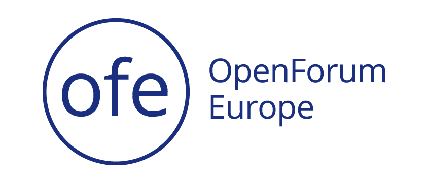
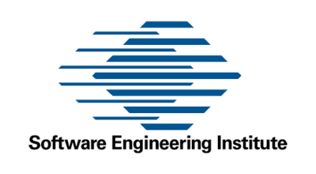

OSPO++ is please to come together with Open Source Ecosystem partners to welcome Big-Tent of Open Technologies communities & individuals, companies & organization in geograohic regions to Socialize Together!

## Events

June 8, 2022     Washington, DC 
April 26, 2022   Brussels, Belgium 

## Partners

  

    

      
  

    <!-- <a href="https://www.mosslabs.io/" target="_blank"> -->
  
  

  

    
  

  

    <!-- <a href="https://openforumeurope.org/" target="_blank"> -->
    
  

  

    
  

  

  <!-- <a href="https://www.sei.cmu.edu/" target="_blank"> -->
    
  

