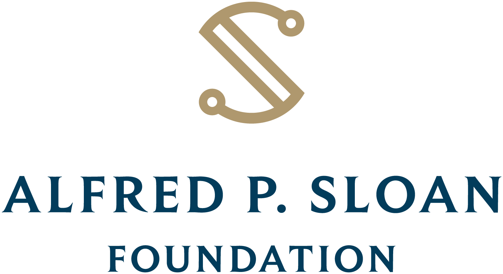
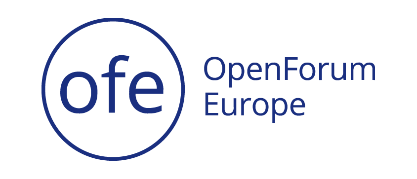

  

    

      

        
        <h1 class="heading">OSPO++</h1>
      

    

  

  

    

      
OSPO++ is a network and a community of collaborative open source program offices in universities, governments, and civic institutions. We're building resources to help create OSPOs, actively engaging in discussions on how to best manage and grow open source programs, and how to garden sustainable communities that last.

      
Register and attend our <a class="get-in-touch" href="https://ospoplusplus.com/working-group/">Working Group Discussions</a>.

      
More questions, or interested in joing us? <a class="get-in-touch" href="mailto:info@mosslabs.io">Get in touch.</a>

    

  

  

    

      

        
Current OSPO++ Members

      

      
      

        
      

      

        
      

      

        
      

      

        
      

      

        
      

      

        
      

      

        
      

      

        
      

      

        
      

      

        
      

      

        
      

      

        
      

      

        
      

      

        
      

      

        
      

      

        
      

      

        
      

      

        
      

      

        
      

      

        
      

      

        
      

      

        
      

      

        
      

      

        
      

      

        
      

      

        
      

      

        
      

    

    

      

        
Recent posts

      

      

        
        
<a href="{{ site.url }}/{{ post.url }}">{{ post.title }} by {{ site.data.authors[post.author].name }}</a>

        
      

    

  

